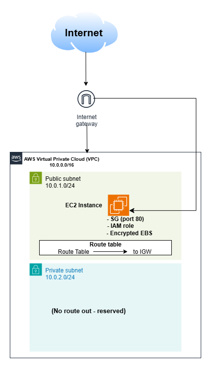

# aws-secure-baseline
A secure AWS environment - segmented networking, least-privilege access controls, and encrypted storage - provisioned entirely with terraform

## Architecture

## What's built
- VPC - CIDR, DNS support and hostname enabled
- Subnets - public and private, CIDRs, unlike private subnet, public subnet has a public ip and can be accessed over the internet.
- Internet gateway + route table - IGW connects the VPC to the internet and route table directs non-local traffic (0.0.0.0/0) to the IGW - associated with the public subnet only, which is what makes it public.
- EC2 - AMI through data source, userdata installs apache on EC2 during booting process for hosting a static website
- Security group- port 80 allowed in, all ports allowed out
- IAM role - grants AmazonS3ReadOnlyAccess, attached through instance profile
- Encryption - EBS root volume 
- Variables/outputs - region, instance type, default tag(specifically project name and environment) were parameterized, public-ip outputed to terminal.

## Security decisions
- **Ports** : The security group inbound rule allows only port 80 and allows all ports for outbound rules. This implements the concept of access control which means only http traffic can reach my server
- **no-SSH** : Port 22 is closed; instance is setup with userdata script and changed by replacing it through terraform, so remote login is not needed for now.
- **IAM role** Roles with permissions was configured and attached to ec2 instance because it is more secure than hardcoding IAM access keys.
- **encryption at rest** encryption for EBS root volume at rest removes the risk of copied and exposed data. its also important for compliance reasons.
- **account IAM split** separate user called for terraform which doesn't have console access in case of accidental access key leak. Also, it makes the audit log meaningful.
- **No secrets in repo** .gitignore contains files should ignore when shipping to public repository because they could contain sensitive information. 

## How to deploy 
prerequisites: Terraform >= 1.7,  AWS credentials configure

      terraform init
      terraform plan
      terraform apply

Tear down: 'terraform destroy'

## Limitations/Roadmap
- [ ] Multiple AZ subnets with load balancer 
- [ ] IAM policy broader than needed
- [ ] No NAT gateway, as a result private subnet can't reach out yet
- [ ] CI checks (terraform fmt/validate) on pull request
